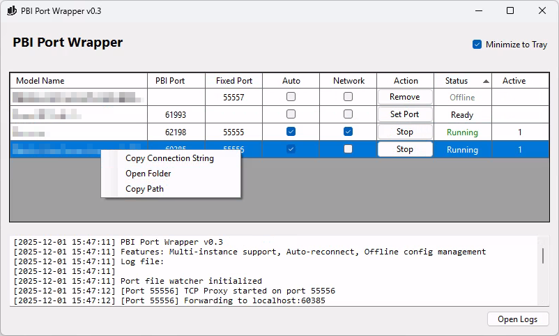

[](https://github.com/pschaer/PBIPortWrapper/releases/latest)
[](https://opensource.org/licenses/MIT)

# PBI Port Wrapper

A TCP port forwarding proxy for Power BI Desktop that provides stable port access — and, since v0.5, stable database names — for external tools like Excel, DAX Studio, and Tabular Editor.

## 🎯 Problem Solved

Power BI Desktop randomizes both connection coordinates every session:
- the **port** its local Analysis Services instance listens on, and
- the **database name** (a GUID) external tools connect to.

That breaks saved Excel workbook connections, hardcoded scripts, and any workflow that depends on a local model. **PBI Port Wrapper** fixes the port with a forwarding proxy and, while *serving*, fixes the database name with a stable alias:

```
Provider=MSOLAP;Data Source=localhost:55555;Initial Catalog=YourAlias
```

## ✨ Features

### Core Functionality
- ✅ **Stable Port Forwarding** - Fixed port number (default: 55555) that doesn't change
- ✅ **Instance Detection** - Finds running Power BI Desktop instances automatically (FileSystemWatcher)
- ✅ **Multi-Instance Support** - Forward multiple Power BI instances simultaneously
- ✅ **Per-Instance Configuration** - Set fixed ports and network access per model
- ✅ **Auto-Connect** - Automatically start forwarding for configured instances
- ✅ **Local Connections** - Full Windows Authentication support
- ✅ **Remote Connections** - Network access with explicit credentials
- ✅ **Connection Tracking** - Number of connected clients

### Serve Sessions (v0.5)
- ✅ **Stable Database Name** - assign a *Serve Alias* per model; while serving, the
  workspace database carries that name, so saved workbook connections survive
  Desktop restarts
- ✅ **Serve / Stop Serving** - one click starts a serve session (rename + forward),
  one click restores Desktop exactly as it was
- ✅ **Crash Recovery** - if the wrapper dies mid-serve, the next start offers to
  resume serving or restore the original database name
- ✅ **Unsaved-Changes Guard** - serving warns before touching a model that may have
  unsaved changes

> ⚠️ While a model is being served, Power BI Desktop shows "Cannot load model"
> errors — this is expected. Don't troubleshoot in Desktop; click **Stop Serving**
> to restore it. Serving is meant as a deliberate, serve-only session
> (see [docs/serving-workflow.md](docs/serving-workflow.md)).


## 📋 Requirements

- Windows 10/11
- Power BI Desktop (any version)

**Note:** No additional software installation required - .NET runtime is included.


## 🚀 Quick Start

**Install** one of two ways:

- **Installer (recommended):** download `PBIPortWrapper.msi`, run it, and launch
  from the Start Menu or the Power BI Desktop **External Tools** ribbon. It also
  registers the External Tool automatically. The MSI is unsigned, so approve the
  SmartScreen *"More info → Run anyway"* prompt. See [docs/installer.md](docs/installer.md).
- **Portable ZIP:** download and extract the ZIP, then run `PBIPortWrapper.exe`
  directly — no installation.

Then:

4. **Start Power BI Desktop** instances with your models
5. **Instances appear automatically** in the data grid as they're detected (instant via FileSystemWatcher)
6. **Configure each instance** - assign fixed port, enable auto-connect if desired
7. **Click "Start"** to begin forwarding for each instance
8. **Connect** from your tools using the configured ports

**To also get a stable database name** (survives Desktop restarts):

9. Expand the row and set a **Serve Alias** in the details panel
10. Click **Serve** and confirm - the row shows *Serving*
11. Connect via `Data Source=localhost:<port>;Initial Catalog=<alias>`
12. When done, click **Stop Serving** - Desktop is restored and usable again


## 📸 Interface



*DataGrid interface showing multiple Power BI instances with individual port mappings, auto-connect settings, and network access controls (v0.3 screenshot - v0.5 adds the Serve column and status)*

### UI Features
- **Serve Column (v0.5)** - Serve / Stop Serving per row, with a distinct *Serving* status
- **Serve Alias Editor (v0.5)** - validated alias editing in the row details panel,
  with an explicit serve-state line and one-click MSOLAP connection string copy
- **System Tray** - Minimize to tray for background operation
- **Copy Connection String Button** - One-click copy for easy sharing to DAX Studio, Excel, etc.
- **Action Buttons** - Set Port > Start > Stop > Remove
- **Fast Detection and Consolidation** - Instant instance detection and matching on configured settings


## 🔌 Connecting from Tools

### Using Copy Connection String Feature
1. Right-click on any instance and choose **Copy Connection String**
2. Connection string is copied to clipboard (e.g., `localhost:55555` or `[your-ip]:55555` when Network is set)

### Excel (Same Computer)
1. Data → Get Data → From Database → From Analysis Services
2. Server name: ```localhost:55555```
3. Authentication: Use Windows Authentication
4. Select your database

> 💡 **Tip:** connect while the model is being *served* and the workbook stores the
> stable alias instead of the session GUID — saved workbooks keep refreshing across
> Power BI Desktop restarts (serve the model again first).

### Excel (Remote Computer)
1. Data → Get Data → From Database → From Analysis Services
2. Server name: ```[your-ip]:55555```
3. Authentication: Use the following User Name and Password
   - Username: Your Microsoft Account email or DOMAIN\username
   - Password: Your password
4. Select your database

### DAX Studio
1. Connect → Connection String
2. Enter: ```Data Source=localhost:55555```
3. Click Connect


## ⚙️ Configuration

### Per-Instance Settings
- **Fixed Port**: The fixed port to listen on for the instance (default: 55555)
- **Auto** - Automatically start forwarding when instance is detected
- **Allow Network Access**: Enable connections from other computers
  - ⚠️ Requires Windows Firewall configuration
  - Remote clients must use explicit credentials

### Configuration File
Configuration is persisted in:
```
%APPDATA%\PBIPortWrapper\config.json
```

### Firewall Configuration

To allow remote connections, run this PowerShell command as Administrator (adapt `-LocalPort` to your configuration):

```powershell
New-NetFirewallRule -DisplayName "PBI Port Wrapper" -Direction Inbound -LocalPort 55555 -Protocol TCP -Action Allow
```

### System Tray Operation
- Click minimize to keep application running in system tray
- Double-click tray icon to restore window

### Install as Power BI Desktop External Tool

**If you used the MSI installer, this is already done** — PBI Port Wrapper appears
on the **External Tools** ribbon after a Power BI Desktop restart. The steps below
are only needed for the **portable ZIP**:

1. Locate the `pbiportwrapper.pbitool.json` file in the installation folder
2. Copy it to your Power BI Desktop external tools directory:
   ```
   \Program Files (x86)\Common Files\Microsoft Shared\Power BI Desktop\External Tools
   ```
3. Edit the JSON file and update the `path` field with the full path to `PBIPortWrapper.exe`:
   ```json
   "path": "C:\\path\\to\\PBIPortWrapper.exe"
   ```
4. Restart Power BI Desktop
5. PBI Port Wrapper will appear in the **External Tools** ribbon tab for quick access


## 📁 File Locations

- **Configuration**: ```%APPDATA%\PBIPortWrapper\config.json```
- **Logs**: ```%APPDATA%\PBIPortWrapper\log.txt``` 
  - Automatically rotates at 5MB per file, keeps 5 historical log files


## 🐛 Known Limitations (v0.5)

- ⚠️ **Desktop errors while serving** - Power BI Desktop shows "Cannot load model"
  while its database is renamed; expected, click **Stop Serving** to restore it
- ⚠️ **Conservative unsaved-changes check** - serving may ask for confirmation even
  right after a save (the Undo history can't prove a save happened)
- ⚠️ **Network access setup** - manual Windows Firewall configuration required
- ⚠️ **Unsigned installer** - the MSI and app are not code-signed, so Windows
  SmartScreen/Defender warns on first run; click **More info → Run anyway**

See [KNOWN_LIMITATIONS.md](KNOWN_LIMITATIONS.md) for details.


## 🗺️ Roadmap

### v0.1 ✅ (Released)
- Initial single-instance proxy support
- Basic port forwarding and authentication
- Activity logging

### v0.2 ✅ (Released)
- Multi-instance support
- Per-instance port mapping, network access control, and auto-connect
- DataGrid-based UI with instance management
- WMI-based process detection

### v0.3 ✅ (Released)
- System tray integration for background operation
- Copy connection string feature
- Set port action button
- Professional app icon/logo
- Improved column layout (Model Name sizing)
- External Tool Integration support
- FileSystemWatcher for instant instance detection
- MVP architecture refactoring
- Structured logging system with rotation
- Named logging categories (DEBUG, INFO, WARNING, ERROR)
- Contextual connection tracking with remote IPs
- Global exception handling with stack traces
- Thread-safe concurrent logging

### v0.4 ✅ (Released)
- Headless `PBIPortWrapper.Core` library - all non-UI logic extracted and unit-tested
- Config-driven auto-connect; rows identified by workspace instead of grid position
- DPI-aware layout fixes

### v0.5 ✅ (Released)
- Serve sessions: stable database names via per-model alias
- Serve/Stop UI with distinct Serving status and validated alias editor
- Crash recovery (resume serving or restore name), unsaved-changes preflight
- Fixes: config lost-update race, manual Stop vs Auto

### v0.5.1 ✅ (Released)
- Single-instance guard (named mutex; second launch fronts the existing window)
- Untitled instances blocked from configuration until the .pbix is saved

### v0.6.0 ✅ (Released)
- Windows MSI installer: Start Menu entry and automatic Power BI External Tool
  registration; silent/unattended install for enterprise deployment
- Installer documentation ([docs/installer.md](docs/installer.md))
- (portable ZIP still available; installer and app are unsigned)

### v0.7 (Planned)
- .odc file generation for one-click Excel connections
- Tray-first workflow UI (rewrite the workflow, not the framework)

### v1.0 (Vision)
- Full XMLA protocol proxy with database name abstraction
- Transparent remote authentication
- Advanced connection pooling

### Future Considerations
- Auto-start with Windows option
- Connection pooling and performance optimization
- Configuration profiles for different scenarios
- Command-line interface for automation
- Telemetry and usage statistics (opt-in)


## 📄 License

This project is licensed under the MIT License - see the [LICENSE.txt](LICENSE.txt) file for details.


## ⚠️ Disclaimer

This is an unofficial tool and is not affiliated with, endorsed by, or supported by Microsoft Corporation. Use at your own risk.

---

**Made with ❤️ for the Power BI community**
