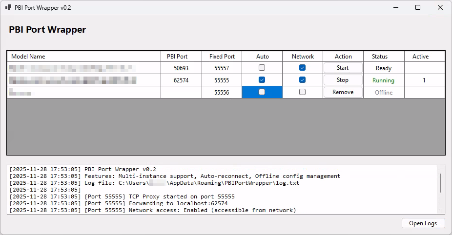

[](https://github.com/pschaer/PBIPortWrapper/releases/latest)
[](https://opensource.org/licenses/MIT)

# PBI Port Wrapper

A TCP port forwarding proxy for Power BI Desktop that provides stable port access for external tools like Excel, DAX Studio, and Tabular Editor.

## 🎯 Problem Solved

Power BI Desktop uses dynamic ports that change with each session, making it difficult to:
- Connect from external tools consistently
- Share connection information with team members
- Automate workflows that depend on local Power BI models

**PBI Port Wrapper** solves this by providing a stable, fixed port that forwards connections to the configured Power BI Desktop instance.

## ✨ Features

### Core Functionality
- ✅ **Stable Port Forwarding** - Fixed port number (default: 55555) that doesn't change
- ✅ **Instant Instance Detection** - Finds running Power BI Desktop instances automatically (FileSystemWatcher)
- ✅ **Multi-Instance Support** - Forward multiple Power BI instances simultaneously
- ✅ **Per-Instance Configuration** - Set fixed ports and network access per model
- ✅ **Auto-Connect** - Automatically start forwarding for configured instances
- ✅ **Local Connections** - Full Windows Authentication support
- ✅ **Remote Connections** - Network access with explicit credentials

### User Interface (v0.3)
- ✅ **System Tray Integration** - Minimize to tray for background operation
- ✅ **Copy Connection String** - One-click copy to clipboard for easy sharing
- ✅ **Direct Port Configuration** - Set Port action button for quick assignment
- ✅ **Professional Branding** - Application icon/logo fully integrated
- ✅ **Optimized Layout** - Intelligent DataGrid column sizing
- ✅ **External Tool Integration** - Register as Power BI Desktop External Tool for ribbon access

### Logging & Diagnostics (v0.3)
- ✅ **Structured Logging** - Clear log levels (DEBUG, INFO, WARNING, ERROR) with named categories
- ✅ **Contextual Details** - Remote IPs, port mappings, model names tracked throughout
- ✅ **Automatic Log Rotation** - Logs rotate at 5MB with retention (keeps 5 files)
- ✅ **Connection Tracking** - Detailed logs of connections/disconnections with counts
- ✅ **Exception Details** - Full stack traces for troubleshooting
- ✅ **Thread-Safe** - Safe for concurrent use across multiple proxy threads

### Code Quality (v0.3)
- ✅ **MVP Architecture** - Clean MVP pattern with separated concerns
- ✅ **Improved Refactoring** - Eliminated God Object pattern, better code organization


## 📋 Requirements

- Windows 10/11
- Power BI Desktop (any version)

**Note:** No additional software installation required - .NET runtime is included.


## 🚀 Quick Start

1. **Download** the latest release
2. **Extract** the ZIP file
3. **Run** ```PBIPortWrapper.exe```
4. **Start Power BI Desktop** instances with your models
5. **Instances appear automatically** in the data grid as they're detected (instant via FileSystemWatcher)
6. **Configure each instance** - assign fixed port, enable auto-connect if desired
7. **Click "Start"** to begin forwarding for each instance
8. **Connect** from your tools using the configured ports


## 📸 Interface



*DataGrid interface showing multiple Power BI instances with individual port mappings, auto-connect settings, and network access controls*

### v0.3 UI Features
- **System Tray** - Minimize to tray for background operation
- **Copy Connection String Button** - One-click copy for easy sharing to DAX Studio, Excel, etc.
- **Set Port Action Button** - Direct port configuration alternative to field editing
- **App Logo** - Professional branding with integrated application icon
- **Smart Column Layout** - Model Name column sized appropriately with responsive grid
- **Instant Detection** - FileSystemWatcher provides real-time instance detection


## 🔌 Connecting from Tools

### Excel (Same Computer)
1. Data → Get Data → From Database → From Analysis Services
2. Server name: ```localhost:55555```
3. Authentication: Use Windows Authentication
4. Select your database

### Excel (Remote Computer)
1. Data → Get Data → From Database → From Analysis Services
2. Server name: ```[your-ip]:55555```
3. Authentication: Use the following User Name and Password
   - Username: Your Microsoft Account email or DOMAIN\username
   - Password: Your password
4. Select your database

### DAX Studio
1. Connect → Connection String
2. Enter: ```Data Source=localhost:55555```
3. Click Connect

### Using Copy Connection String Feature (v0.3)
1. Click the **Copy Connection String** button for any instance
2. Connection string is copied to clipboard (e.g., `localhost:55555`)
3. Paste into your tool of choice
4. Easy sharing with team members!


## ⚙️ Configuration

### Per-Instance Settings
- **Fixed Port**: The fixed port to listen on for the instance (default: 55555)
- **Auto** - Automatically start forwarding when instance is detected
- **Allow Network Access**: Enable connections from other computers
  - ⚠️ Requires Windows Firewall configuration
  - Remote clients must use explicit credentials

### Configuration File
Configuration is persisted in:
```
%APPDATA%\PBIPortWrapper\config.json
```

### Firewall Configuration

To allow remote connections, run this PowerShell command as Administrator (adapt `-LocalPort` to your configuration):

```powershell
New-NetFirewallRule -DisplayName "PBI Port Wrapper" -Direction Inbound -LocalPort 55555 -Protocol TCP -Action Allow
```

### System Tray Operation (v0.3)
- Click minimize to keep application running in system tray
- Double-click tray icon to restore window
- Application continues forwarding connections while in tray
- No performance impact from tray minimization

### Install as Power BI Desktop External Tool (v0.3)

You can register PBI Port Wrapper as a Power BI Desktop External Tool for one-click launch directly from the ribbon:

1. Locate the `pbiportwrapper.pbitool.json` file in the installation folder
2. Copy it to your Power BI Desktop external tools directory:
   ```
   \Program Files (x86)\Common Files\Microsoft Shared\Power BI Desktop\External Tools
   ```
3. Edit the JSON file and update the `path` field with the full path to `PBIPortWrapper.exe`:
   ```json
   "path": "C:\\path\\to\\PBIPortWrapper.exe"
   ```
4. Restart Power BI Desktop
5. PBI Port Wrapper will appear in the **External Tools** ribbon tab for quick access


## 📁 File Locations

- **Configuration**: ```%APPDATA%\PBIPortWrapper\config.json```
- **Logs**: ```%APPDATA%\PBIPortWrapper\log.txt``` 
  - Automatically rotates at 5MB per file
  - Keeps 5 historical log files
  - Professional formatting with timestamps and log levels
  - Named categories for contextual logging


## 📊 Logging Details (v0.3)

### Log Levels
- **DEBUG** - Detailed diagnostic information
- **INFO** - General informational messages
- **WARNING** - Warning messages for potential issues
- **ERROR** - Error messages with full exception details

### Log Examples
```
[2025-12-01 14:23:45] [INFO] [ProxyManager] Starting proxy for Model_Sales on port 55555
[2025-12-01 14:23:46] [INFO] [TcpProxyService] Client connected from 192.168.1.100:54321
[2025-12-01 14:23:50] [INFO] [TcpProxyService] Active connections: 1
[2025-12-01 14:23:55] [INFO] [ProxyManager] Client disconnected from 192.168.1.100
```

### Contextual Information Tracked
- Remote IP addresses and ports
- Model names and fixed port mappings
- Connection count and lifecycle
- Full exception stack traces for errors
- Performance metrics


## 🐛 Known Limitations (v0.3)

- ⚠️ **Database name changes** when Power BI Desktop restarts - requires reconnection
- ⚠️ **Network access setup** - manual Windows Firewall configuration required
- ⚠️ **Auto-restart behavior** - When "Auto" mode is enabled, stopping a proxy will restart it on the next refresh cycle if the PBI instance is still running

### Known Limitation Details: Auto-Restart Behavior

When "Auto" checkbox is enabled, the proxy will automatically restart if:
- PBI Port Wrapper is started and PBI Desktop instance is running, OR
- PBI Port Wrapper is running and PBI Desktop instance is started

**Current behavior**: Once enabled, auto mode will restart the proxy on every refresh cycle if status="Ready", even if you manually stopped it.

**Workaround**: Disable the "Auto" checkbox before manually stopping a proxy if you want it to remain stopped.

This is a known limitation due to simplified state tracking across refresh cycles. Future versions may implement proper state machine tracking.


## 🗺️ Roadmap

### v0.1 ✅ (Released)
- Initial single-instance proxy support
- Basic port forwarding and authentication
- Activity logging

### v0.2 ✅ (Released)
- Multi-instance support
- Per-instance port mapping, network access control, and auto-connect
- DataGrid-based UI with instance management
- WMI-based process detection

### v0.3 ✅ (Released)
- System tray integration for background operation
- Copy connection string feature
- Set port action button
- Professional app icon/logo
- Improved column layout (Model Name sizing)
- External Tool Integration support
- FileSystemWatcher for instant instance detection
- MVP architecture refactoring
- Structured logging system with rotation
- Named logging categories (DEBUG, INFO, WARNING, ERROR)
- Contextual connection tracking with remote IPs
- Global exception handling with stack traces
- Thread-safe concurrent logging

### v0.x (Future)
- Enhanced auto-reconnect with proper state tracking
- Better handling of Auto mode vs manual Stop
- Additional configuration profiles
- Performance optimizations

### v1.0 (Vision)
- Full XMLA protocol proxy with database name abstraction
- Transparent remote authentication
- Advanced connection pooling

### Future Considerations
- Improvements to installation process
- Auto-start with Windows option
- Connection pooling and performance optimization
- Configuration profiles for different scenarios
- Command-line interface for automation
- Telemetry and usage statistics (opt-in)


## 📄 License

This project is licensed under the MIT License - see the [LICENSE.txt](LICENSE.txt) file for details.


## ⚠️ Disclaimer

This is an unofficial tool and is not affiliated with, endorsed by, or supported by Microsoft Corporation. Use at your own risk.

---

**Made with ❤️ for the Power BI community**
