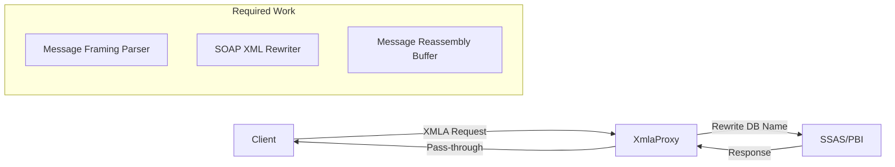
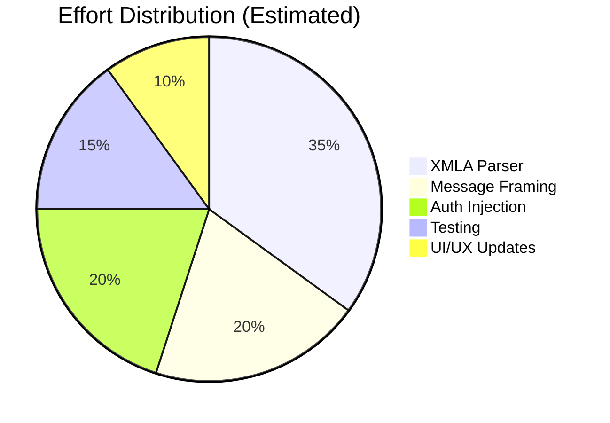

> **Archived research, December 2025.** Salvaged from the Gitea wiki when it was
> retired; kept because it is the evidence behind a rule the code still follows.
> It describes the v0.3 codebase and is **not** a description of how the app works
> today — see [../http-bridge.md](../http-bridge.md) for that.
>
> Links to source files were removed: they pointed at absolute local paths, and
> most of the files they named were retired with port forwarding in #126.

# v1.0 High-Level Gap Analysis (Issue #13)

This document provides a high-level assessment of the missing pieces, complexity, and likely challenges for achieving the v1.0 vision of PBIRelay.

---

## Current State (v0.3)

| Component | Implementation | Notes |
|-----------|----------------|-------|
| `TcpProxyService` | Simple TCP relay | Byte-for-byte forwarding via `CopyStreamAsync` |
| `XmlaProxyService` | Placeholder only | Regex-based database rewriting (not integrated) |
| `PowerBIDetector` | ADOMD discovery | Uses Windows Integrated Auth locally |
| Authentication | Local Windows only | Relies on current user context |

### What Works Today
- ✅ Detects running Power BI Desktop instances
- ✅ Reads dynamic port from `msmdsrv.port.txt`
- ✅ Queries database name via ADOMD (local Windows Auth)
- ✅ Forwards TCP traffic on fixed ports
- ✅ Allows network access with explicit credentials (manual)

### Critical Limitations
1. **Database Name Changes Each Restart** - Power BI generates a new GUID-based database name on every load
2. **Authentication Single-Hop** - Windows Auth can't pass through the proxy to remote clients

---

## v1.0 Vision Requirements

| Requirement | Description |
|-------------|-------------|
| **Database Name Abstraction** | Client uses a stable alias (e.g., `SalesModel`); proxy rewrites to actual GUID at runtime |
| **Transparent Remote Auth** | Remote users authenticate once; proxy handles credential delegation to SSAS |

---

## Gap Analysis

### Gap 1: Full XMLA Protocol Proxy

**What's Missing:**

| Area | Current | Required |
|------|---------|----------|
| Message Framing | None (byte stream) | Parse XMLA/SOAP envelope with `[4-byte length][payload]` framing |
| Message Parsing | Regex on chunks | Full XML parsing of `Discover`/`Execute` SOAP messages |
| Database Rewriting | Partial regex | Rewrite `<DatabaseID>`, `<Catalog>`, `Initial Catalog=` in all contexts |
| Response Handling | Pass-through | May need to rewrite database refs in responses |
| Streaming | 8KB buffer | Handle multi-chunk messages, message reassembly |

**Complexity Assessment:**

| Factor | Rating | Notes |
|--------|--------|-------|
| Implementation Effort | **High** | Requires proper XMLA message parser, not just regex |
| Risk | **Medium** | XMLA is well-documented but protocol edge cases exist |
| Testing Complexity | **High** | Need to simulate various XMLA message patterns |

**References:**
- XMLA uses SOAP 1.1 with `Discover` and `Execute` methods
- Power BI Desktop uses ASSL/TMSL over XMLA
- Messages can span multiple TCP chunks

---

### Gap 2: Transparent Remote Authentication

**What's Missing:**

| Area | Current | Required |
|------|---------|----------|
| Auth Protocol | Windows Integrated | Kerberos delegation or credential forwarding |
| Double-Hop | ❌ Not supported | ✅ Client → Proxy → SSAS with user identity |
| Credential Storage | None | Secure credential caching or pass-through |

**Authentication Options:**

| Option | Complexity | Requirements | Viability |
|--------|------------|--------------|-----------|
| **Kerberos Constrained Delegation (KCD)** | Very High | Domain admin, SPN setup, AD configuration | ❌ Impractical for desktop tool |
| **EffectiveUserName** | Medium | SSAS configuration, admin rights | ⚠️ Requires server-side config |
| **Credential Prompt + Storage** | Medium | Secure credential store, XMLA auth injection | ✅ Most viable |
| **Basic Auth via XMLA** | Medium | Inject credentials into SOAP headers | ✅ Possible |

**Recommendation:** 

> [!IMPORTANT]
> Kerberos delegation is impractical for a lightweight desktop tool. The most viable approach is:
> 1. Prompt user for credentials when enabling remote access
> 2. Store credentials securely (Windows Credential Manager)
> 3. Inject credentials into XMLA SOAP headers on proxied requests

**Complexity Assessment:**

| Factor | Rating | Notes |
|--------|--------|-------|
| Implementation Effort | **Medium-High** | Need to inject auth into SOAP envelope |
| Security Risk | **Medium** | Must handle credentials securely |
| UX Impact | **Low** | One-time credential prompt is acceptable |

---

## Summary of Challenges

### Biggest Challenges (Ranked)

| # | Challenge | Complexity | Mitigation |
|---|-----------|------------|------------|
| 1 | **XMLA Message Parsing** | High | Use existing XML libraries; might leverage AMO/ADOMD internals |
| 2 | **Message Framing/Reassembly** | Medium-High | Implement proper buffering for multi-chunk messages |
| 3 | **Credential Injection** | Medium | Study XMLA SOAP auth headers; may need SOAP toolkit |
| 4 | **Testing Coverage** | High | Create comprehensive XMLA message test suite |
| 5 | **Edge Cases** | Medium | Large queries, binary data, BLOB columns |

### Complexity Estimate

---

## Recommended Next Steps

1. **Prototype XMLA Message Parser**
   - Implement framing detection (`[4-byte length][payload]`)
   - Parse SOAP envelope to extract database references
   - Test with captured XMLA traffic from DAX Studio

2. **Research Auth Injection**
   - Study XMLA SOAP header format for authentication
   - Prototype credential injection without Kerberos

3. **Create Test Infrastructure**
   - Record XMLA traffic from various tools (Excel, DAX Studio, Tabular Editor)
   - Build replay-based tests for proxy validation

4. **Consider Alternative Approaches**
   - Evaluate if AMO/ADOMD can be used as an intermediary
   - Consider whether Power BI Gateway patterns apply

---

## Open Questions for User

1. **Priority:** Is database name abstraction or remote auth more important for v1.0 MVP?
2. **Scope:** Should v1.0 support all XMLA operations or focus on read-only (DAX queries)?
3. **Environment:** Will this need to work in non-domain (workgroup) environments?
4. **Testing:** Do you have access to tools to capture XMLA traffic for testing?
