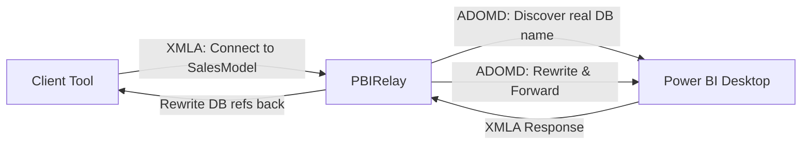
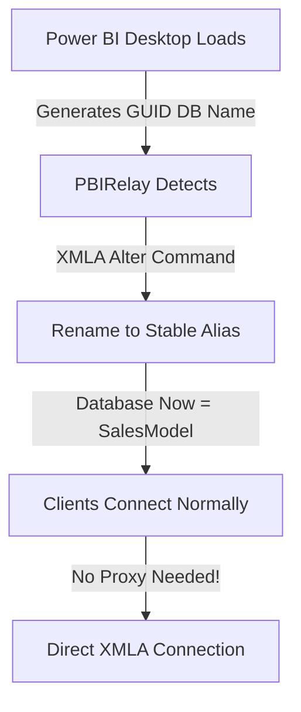

> **Archived research, December 2025.** Salvaged from the Gitea wiki when it was
> retired; kept because it is the evidence behind a rule the code still follows.
> It describes the v0.3 codebase and is **not** a description of how the app works
> today — see [../serving-workflow.md](../serving-workflow.md) for what shipped.
>
> Links to source files were removed: they pointed at absolute local paths, and
> most of the files they named were retired with port forwarding in #126.

# Alternative Approaches for Database Name Abstraction

This page explores alternative implementation strategies discovered during Phase 2 research that may significantly simplify the v1.0 database name abstraction objective.

---

## Overview

Initial gap analysis suggested implementing a full XMLA protocol parser to intercept and rewrite database references at the TCP stream level. However, research revealed two potentially simpler approaches:

1. **Middle-Tier ADOMD.NET Proxy** - Use high-level client libraries instead of raw protocol parsing
2. **Direct Database Rename** - Rename the database directly on Power BI Desktop instance

---

## Approach 1: Middle-Tier ADOMD.NET Proxy

### Architecture



### How It Works

**Discovery Phase:**
1. PBIRelay detects Power BI instance and actual database name (already implemented)
2. User configures stable alias (e.g., `SalesModel`) for the instance
3. Proxy creates mapping: `SalesModel` → `abc-123-def-456-guid`

**Request Handling:**
1. Client connects to proxy requesting database `SalesModel`
2. Proxy intercepts connection via custom XMLA listener
3. Proxy uses ADOMD.NET to open connection to actual PBI instance
4. For each XMLA request from client:
   - Parse SOAP envelope to identify database references
   - Replace `SalesModel` with actual GUID name
   - Forward modified request via ADOMD.NET
   - Receive response and reverse the replacement
   - Return modified response to client

### Implementation Strategy

```csharp
public class AdomdProxyService
{
    private Dictionary<string, string> _aliasMapping; // Alias → Real DB Name
    private AdomdConnection _backendConnection;
    
    public void HandleClientRequest(XmlDocument xmlaRequest)
    {
        // 1. Parse incoming XMLA SOAP envelope
        var dbReferences = ExtractDatabaseReferences(xmlaRequest);
        
        // 2. Substitute alias with real name
        foreach (var dbRef in dbReferences)
        {
            if (_aliasMapping.ContainsKey(dbRef.Value))
            {
                dbRef.Value = _aliasMapping[dbRef.Value];
            }
        }
        
        // 3. Forward via ADOMD.NET
        var command = new AdomdCommand(xmlaRequest.OuterXml, _backendConnection);
        var response = command.Execute();
        
        // 4. Reverse substitution in response
        ReverseSubstitution(response);
        
        // 5. Return to client
        return response;
    }
}
```

### Advantages

- **No TCP Parsing** - Use high-level ADOMD.NET APIs instead of raw protocol
- **Reuse Existing Code** - Leverage PowerBIDetector for discovery
- **Standard Libraries** - Well-tested Microsoft client libraries
- **Easier Testing** - Can unit test with mocked ADOMD connections
- **Protocol Agnostic** - Works regardless of XMLA wire format changes

### Limitations

- **SOAP XML Parsing Still Required** - Must parse XMLA content to rewrite DB refs
- **Performance Overhead** - Double connection (client→proxy→PBI)
- **Metadata Leakage** - Discovery operations might expose real DB name
- **State Management** - Track which client uses which alias
- **Not All XMLA Operations** - Some operations may not support rewriting

---

## Approach 2: Direct Database Rename ⭐ (Potentially Simplest!)

### Concept

Instead of proxying and rewriting, **rename the database directly** on the Power BI Desktop instance immediately after detection.

### Architecture



### Implementation via AMO/TOM

```csharp
using Microsoft.AnalysisServices.Tabular;

public bool RenameDatabase(int port, string stableName)
{
    try
    {
        using (var server = new Server())
        {
            server.Connect($"localhost:{port}");
            
            // Get the database (assuming single DB per PBI instance)
            Database db = server.Databases[0];
            string originalName = db.Name;
            
            _logger.LogInfo($"Attempting rename: {originalName} → {stableName}");
            
            // Rename the database
            db.Name = stableName;
            db.Update();
            
            // Verify the rename worked
            server.Refresh();
            if (server.Databases.FindByName(stableName) != null)
            {
                _logger.LogInfo($"✅ Successfully renamed to {stableName}");
                return true;
            }
        }
    }
    catch (Exception ex)
    {
        _logger.LogError($"Database rename failed: {ex.Message}");
        return false;
    }
}
```

### Advantages

- **Dramatically Simpler** - No XMLA parsing, no proxying required!
- **Zero Overhead** - Clients connect directly to Power BI
- **No Protocol Knowledge** - Uses standard AMO/TOM libraries
- **Immediate Benefit** - Solves the problem at the source
- **Existing Infrastructure** - Leverages current detection mechanism

### Open Questions & Risks

**Critical Questions:**
1. Does PBI Desktop allow database renaming?
2. Will rename persist across data refreshes?
3. Will PBI Desktop regenerate name on file save?

**Potential Failure Modes:**
- PBI Desktop regenerates name on refresh → Re-apply rename after each refresh
- PBI Desktop blocks rename operation → Fall back to Approach 1
- Rename breaks internal PBI functionality → Revert and use Approach 1

---

## Recommended Path Forward

### Phase 1: Test Direct Rename ⚡

**Priority: Immediate**

Create a minimal proof-of-concept to test if Power BI Desktop allows database renaming:

1. Create simple console app using AMO/TOM
2. Connect to running Power BI Desktop instance
3. Attempt to rename database
4. Test various scenarios:
   - Data refresh
   - File save/reload
   - Report interactions

**Success Criteria:**
- ✅ Rename operation completes without error
- ✅ Database accessible by new name
- ✅ Name persists across refresh operations
- ✅ No PBI Desktop functionality breaks

---

## Comparison Matrix

| Aspect | Direct Rename | ADOMD.NET Proxy | Raw XMLA Parser |
|--------|---------------|-----------------|-----------------|
| Complexity | ⭐ Very Low | ⭐⭐ Medium | ⭐⭐⭐⭐⭐ Very High |
| Performance | ⭐⭐⭐⭐⭐ No overhead | ⭐⭐⭐ Some overhead | ⭐⭐⭐⭐ Minimal overhead |
| Reliability | ❓ Unknown | ⭐⭐⭐⭐ Proven | ⭐⭐ Complex |
| Maintenance | ⭐⭐⭐⭐⭐ Minimal | ⭐⭐⭐ Moderate | ⭐ High |
| Risk | ❓ Unknown | ⭐⭐⭐⭐ Low | ⭐⭐ Medium |


---

## PoC Test Results (2025-12-06)

### Direct Database Rename Test

**Test Setup:**
- Created console application using AMO/TOM
- Renamed Power BI Desktop database from GUID to `TestStableName`
- Tested with running Power BI Desktop instance

**Results:**

| Aspect | Result | Details |
|--------|--------|---------|
| **AMO/TOM Rename** | ✅ Success | `database.Name = newName; database.Update()` completed without error |
| **External XMLA Access** | ✅ Success | Remote connections using `Initial Catalog=TestStableName` worked perfectly |
| **Query Execution** | ✅ Success | DAX queries via external tools (PBIRelay) successful |
| **Power BI Desktop** | ❌ **FAILURE** | Model unloadable, error: "database does not exist" |

**Error Message:**
```
Cannot load model

Either the user, 'LOCALDOMAIN\user', does not have access to the 
'aba9fae2-966f-4048-bf70-c621ae174ab0' database, or the database does not exist.
```

**Analysis:**
- Power BI Desktop maintains internal references to original GUID name
- Renaming the AS database externally creates a mismatch
- PBI Desktop cannot locate the database by its original name
- Table view becomes empty: "You haven't loaded any data yet"

**Conclusion:**
Direct Database Rename is **NOT VIABLE** for the v1.0 implementation because:
1. Breaking Power BI Desktop is unacceptable
2. Users need to work with models, not just query them
3. Scope is limited to running instance (no .pbix modification)

**Recommendation:**
Proceed with **Approach 1: ADOMD.NET Proxy** as the v1.0 implementation strategy.
