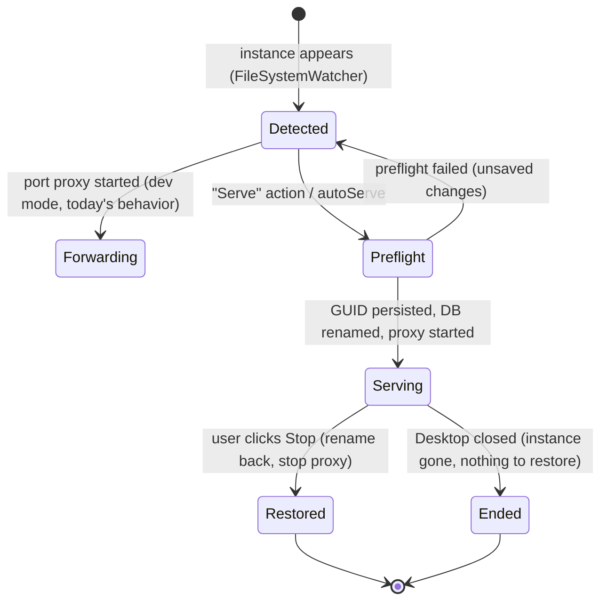

# Serving Workflow — v1.0 Design

Status: **implemented in v0.5.0 (2026-07-19)** — serve profiles (#56), session
lifecycle (#57), crash recovery (#58), Serve/Stop UI + dirty probe (#59).
Experiments E1–E5 below validated the design (2026-07-18/19). Remaining rungs of
the release ladder (v0.6 .odc/tray, phase-2 HTTP bridge) are unchanged.

## Problem

External tools (Excel, DAX Studio, Tabular Editor, scripts) connect to Power BI Desktop's
local Analysis Services instance via `Data Source=localhost:<port>;Initial Catalog=<db>`.
Both values are randomized per Desktop session:

- **Port** — solved since v0.1 by TCP forwarding (stable fixed port per model).
- **Database name** — a GUID that changes every session, breaking saved Excel
  workbook connections and hardcoded scripts.

A wire-level protocol-rewriting proxy (MITM) was evaluated and **shelved** — see
[HANDOFF.md](HANDOFF.md) for the research and pre-mortem that led to this decision.

## Chosen approach: rename at the source, manage the constraint with workflow

Preliminary tests show the workspace database can be **renamed on the live instance**
(TMSL/AMO) to a stable alias. Caveat: Power BI Desktop itself stops working correctly
while the database is renamed. The workflow makes this safe by strictly separating:

- **Development** — you edit the model in Desktop. No renaming; port forwarding only.
- **Serving** — you open the .pbix *to serve it*. The database is renamed to its stable
  alias, external clients connect, and you do not edit or save until the session ends.

**Session model: serve-only sessions** (decided). No mid-session dev↔serve toggling.
Opening a model for serving is a deliberate act, like starting a server.

## Serve profiles

One per model, persisted in config:

```json
{
  "modelName": "Sales",
  "alias": "Sales",          // stable Initial Catalog
  "fixedPort": 55555,        // stable Data Source port
  "allowNetwork": false,
  "autoServe": false         // start serving automatically on detection
}
```

Resulting stable connection string, valid across all future sessions:

```
Provider=MSOLAP;Data Source=<machine>:55555;Initial Catalog=Sales
```

## Session lifecycle



Steps on entering **Serving**:

1. **Preflight** — refuse if Desktop has unsaved changes (detect `*` in window title).
2. **Persist recovery record** `{originalGuid, alias, pid, timestamp}` to config
   *before* any mutation. This is the crash-recovery anchor.
3. **Rename** workspace DB → alias (TMSL via AMO / AdomdClient, already a dependency).
4. **Start forwarder** on the profile port; bind to network only if profile allows
   (existing firewall warning flow applies).
5. **Surface**: tray toast "Serving *Sales* at HOST:55555" with
   *Copy connection string* and *Save .odc file* actions.

Steps on ending:

- **Stop button**: warn if active connections (existing flow) → rename DB back to
  original GUID → stop proxy → clear recovery record. Desktop is left usable.
- **Desktop closed**: instance dies with Desktop; stop proxy, clear recovery record.
- **Wrapper crash**: on next start, a recovery record + a live instance whose DB
  matches an alias ⇒ offer "restore original name" or "resume serving".

The .pbix file on disk is never touched by any of this; renaming affects only the
in-memory workspace database.

## Excel deliverable: .odc generation

"Save .odc file" writes an Office Data Connection file with the stable connection
string and cube/model name. Colleagues double-click it and get a PivotTable — they
never see a connection string. This is the primary Excel self-service artifact.

## LAN sharing (RESOLVED 2026-07-18 by E1 — see issue #39)

Desktop's workspace instance authenticates via Windows auth and its server admin is
the owning user. Forwarding does not change the principal.

**E1 result:** a remote connection through the forwarder succeeds **only as the
owning user** (same `DOMAIN\user`: Excel wizard lists the database, PivotTable
queries work). A *different* user on a remote machine is refused at database
enumeration ("The Data Connection Wizard cannot obtain a list of databases from
the specified data source").

Consequences for v0.7:

- **Same-account LAN access** (second machine, same user) works today: profile
  option + firewall docs. Supported and documented as such.
- **Multi-user LAN sharing** needs the **auth-terminating HTTP/XMLA bridge**
  (msmdpump-style — proxy authenticates locally as the owning user, serves
  documented XMLA-over-HTTP to remote clients). Scoped phase-2 component, remote
  leg only. Research links in [HANDOFF.md](HANDOFF.md).

## Experiments (status as of 2026-07-18)

| # | Question | Decides | Status |
|---|----------|---------|--------|
| E1 | Can a second Windows user connect to the workspace instance through the forwarder? | LAN scope: config option vs phase-2 HTTP bridge | **Done — denied for other users; same-user works (see above)** |
| E2 | Rename → rename back: does Desktop save/refresh normally afterwards? | Whether *Stop* can be graceful | **Done — roundtrip clean at AS level AND Desktop save/refresh normal afterwards; DB ID immutable through rename. Stop can be graceful (#40)** |
| E3 | What exactly breaks in Desktop while renamed (save? refresh? errors shown)? | Warning copy & guardrail severity | **Done — Desktop errors spontaneously ("Cannot load model", name-based lookup) even without interaction; Save itself doesn't throw; close is clean. Warning copy + one-click Stop required (#41)** |
| E4 | Does Excel/MSOLAP connect *without* `Initial Catalog` to a single-DB instance? | If yes, some flows may not need renaming at all | **Done — initial connection needs no catalog (ADOMD auto-binds; Excel wizard enumerates). BUT Excel persists the resolved GUID into the workbook connection string, so saved workbooks break on the next Desktop session — renaming remains required for Excel reuse (#42)** |
| E5 | Desktop auto-recovery behavior after a session that ended while renamed | Recovery UX | **Done — clean close, clean reopen (fresh workspace: new port, new GUID), zero residue. Desktop needs no recovery from us; the recovery record covers only the wrapper-crash-while-serving case, matched by immutable DB ID (#43)** |

## Release ladder (always shippable — see pre-mortem in HANDOFF.md)

- **v0.4** — core extraction: headless `PBIPortWrapper.Core` (state out of the grid),
  identical user-facing features. Prerequisite for everything below.
- **v0.5** — serve profiles + rename engine + session lifecycle. Excel-local complete.
- **v0.6** — .odc generation, tray-first workflow UI, crash-recovery polish.
- **v0.7** — LAN per E1 outcome (config option or HTTP bridge).
- **v1.0** — "a stable local server for your semantic models."

## Shelved: transparent TCP MITM proxy

Full wire-level rewriting was researched and found *feasible but not worth it* for
these use cases (no server-side library exists; greenfield implementation of DIME
framing + SSPI sealing; see HANDOFF.md for spec links: MS-SSAS transport, content
negotiation, MS-BINXML, Xpress9). Revisit only if a use case appears that renaming
cannot serve.
