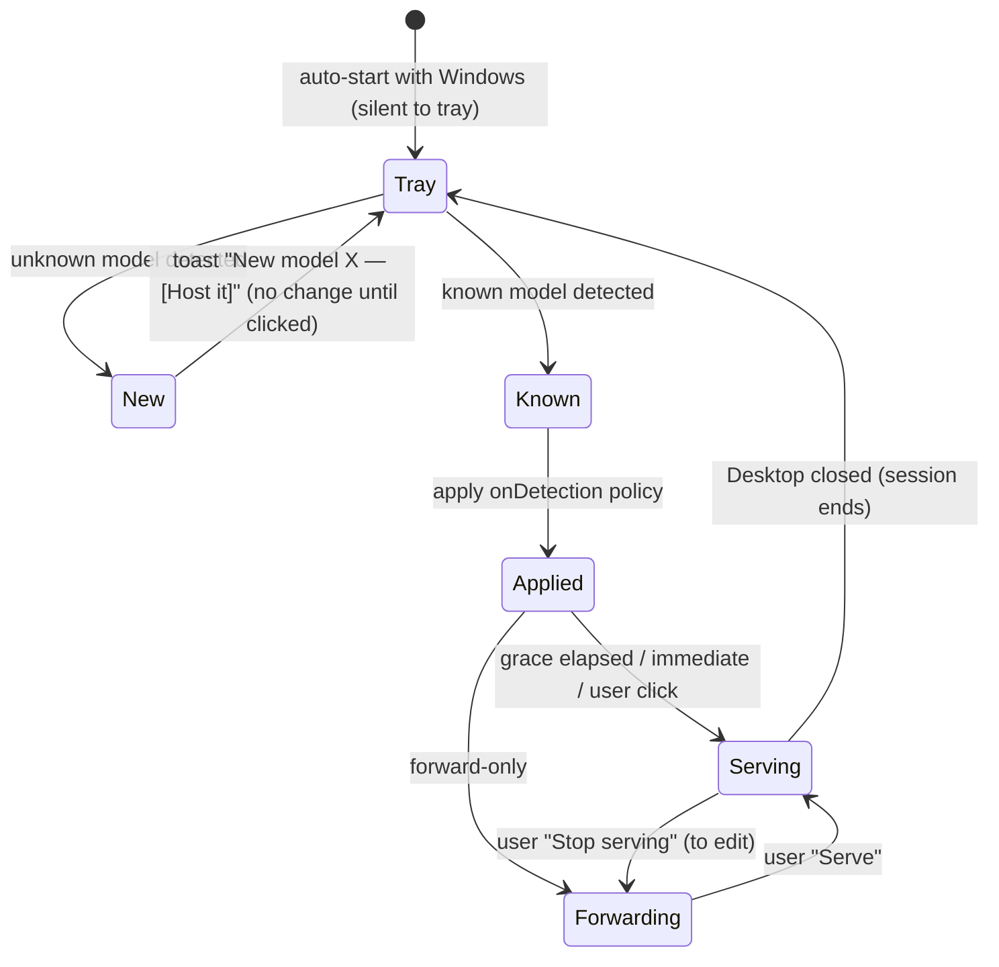

# Tray-first Workflow — v0.7 Design

> **Historical on vocabulary.** Shipped in v0.7; the Forward state it describes was
> retired in v0.8 (#126), leaving Off and Serve. Everything else — the persona,
> on-detection policies, tray-as-primary — is current.

Status: **design** (2026-07-24). Derived from a workflow-from-scratch discovery
session. This redesigns the *workflow*, not the framework (WinForms stays) — the
tracking issue is #47. It builds on the serve-session mechanics already shipped in
v0.5 ([serving-workflow.md](serving-workflow.md)); nothing here changes how the
rename/forward machinery works underneath.

## Who this is for

The guiding persona: **"a poor man's SQL Server Analysis Services."** The user runs
Power BI Desktop as a cheap, always-there Analysis Services instance and connects to
it from **Excel** (and DAX Studio, Tabular Editor, scripts). The model is *hosted for
consumption*, not actively edited. What matters:

- stable connection coordinates (**port + database name**) that **survive Desktop
  restarts**, so saved Excel workbooks and `.odc` files keep working;
- often **several models hosted at once**, like a server with several databases;
- **almost no interaction** in the steady state — the host is just *there*.

Editing a model is the exception, and must stay possible (serving renames the DB,
which blocks Desktop editing — see serving-workflow.md).

## Core concept: a *hosted model*

A hosted model is a serve profile the app remembers. Fields:

| Field | Meaning |
|-------|---------|
| `alias` | Stable database name (Initial Catalog). Defaults from the model name. |
| `port` | Stable Data Source port. Auto-assigned or user-fixed. |
| `onDetection` | What to do when this model's Desktop instance appears (below). |
| `allowNetwork` | Expose on the LAN (advanced; same-user only — E1). Default off. |

### The state model: `Off → Forward → Serve`

A single per-model control with three states, replacing the separate
Start/Stop + Serve/Stop-Serving pairs (the harmonization from #47 / the #82
discussion):

- **Off** — not proxied.
- **Forward** — stable **port** only; Desktop stays fully editable; DB name is the
  session GUID (today's "Start").
- **Serve** — stable **port + name**; DB renamed to `alias`; Desktop shows "Cannot
  load model" while served (today's "Serve"). *Serve is Forward plus a rename* — the
  control makes that an explicit upgrade, not a separate concept.

The **default state on detection** comes from the model's `onDetection` policy.

### `onDetection` policy (per model)

Auto-hosting renames the DB the moment Desktop opens the model — which is wrong if
the user opened it to *edit*. So the behaviour is configurable per model:

- **Host — grace period** *(default)* — toast *"Hosting **X** in ~10 s —
  [Edit instead]"*; auto-serves if ignored, one click keeps it editable. Hands-off
  with an escape hatch.
- **Host immediately** — serve on detection (true server behaviour). To edit, click
  *Stop serving* in the tray and Desktop recovers.
- **Forward only** — forward the port (safe, editable); promoting to Serve needs a
  deliberate click.
- **Do nothing** — ignore this model until acted on.

A brand-new (never-configured) model detected for the first time → toast *"New model
**X** detected — [Host it]"*. Nothing renames until clicked; hosting it creates the
profile (alias from the model name, port auto-assigned). This is the global default
for unknown models.

## Lifecycle & automation



- **Auto-start with Windows** — the host launches at login, silent to the tray, so
  the "server" is simply up. Offered as an installer / settings option (opt-in).
- **Re-host across restarts** — when a hosted model's Desktop instance reappears
  (new port, new GUID), the app re-applies the profile: **same `alias`, same
  `port`**. Excel workbooks and `.odc` files keep resolving. This is the promise
  that makes it a "server."
- **Crash recovery** — unchanged from v0.5 (recovery record matched by immutable DB
  ID; resume serving or restore name).

## Excel hand-off: `.odc` as the headline

For a hosted model, one click writes a ready-to-open **Office Data Connection
(`.odc`)** file carrying the stable connection string and model name. Colleagues (or
the user) double-click it and get a PivotTable — no connection string ever seen. This
is the primary self-service artifact.

**Copy Connection String** stays for DAX Studio / Tabular Editor / advanced users.

Because re-hosting keeps `alias`+`port` stable, a saved `.odc` (or a workbook built
from it) keeps working across Desktop restarts — the core win.

## Surfaces

**Tray = primary.** A tray menu lists the hosted models, each with its current state
and quick actions:

```
PBIRelay
├─ Sales            ● Serving  :55555
│    ├─ Stop serving
│    ├─ Save .odc…
│    └─ Copy connection string
├─ Finance          ○ Forward  :55556
│    ├─ Serve
│    └─ …
├─ ── (newly detected) ──
│    └─ New model "Budget" — Host it
├─ Open dashboard…      (the admin/diagnostics window)
└─ Exit
```

Plus toasts: new-model, grace-period countdown, "ready — here's your connection",
and edit-conflict prompts. Designed to scale to several hosted models without
clutter.

**Grid / main window = diagnostics & admin.** The existing DataGridView becomes the
management surface (one click from the tray): first-run setup, per-model
configuration (alias, port, `onDetection`, network), status-at-a-glance, connection
tracking, and logs. It is no longer the day-to-day surface.

## Network / LAN

Local-first: hosted models bind to `localhost` for same-machine Excel. `allowNetwork`
stays a **per-model advanced toggle** (with the firewall note); it works only for the
**same domain user on a remote machine** (E1 finding).

**"Network by default" is deferred**, and depends on solving **other-users' access** —
the single most important future milestone. That is the auth-terminating
XMLA-over-HTTP bridge (#77) and its feasibility spike (#76: can a proxy terminate and
re-issue SSPI/Negotiate auth). The tray UI is designed so that flipping network from
"advanced toggle" to "on by default" is a later change, not a rewrite.

## Relationship to the unsaved-changes probe (#82)

The grace-period / "Edit instead" escape hatch is the user-facing safety net, so the
serve preflight no longer needs to be a hard gate. The language-independent probe
improvement (#82, solution A) folds in here — sequence it with the tray work rather
than as a standalone refactor.

## Implementation increments (sub-issues of #47)

Each is one PR, in dependency order:

1. **Core — serve-profile policy model + `Off/Forward/Serve` state machine.** Extend
   the profile with `onDetection`; model the tri-state transitions headless in
   `PBIRelay.Core`, unit-tested. Foundation for everything below.
2. **Tray-first surface.** Tray menu listing hosted models with per-model state +
   quick actions, and the toast set (new-model, grace period, ready, edit-conflict).
   The new primary UX.
3. **`.odc` generation.** *Save .odc…* action + connection-string helper.
4. **Auto-start with Windows.** Login launch, silent to tray; installer/settings
   opt-in.
5. **Grid → diagnostics/admin role.** Repurpose the window: per-model config editor,
   status, logs; remove day-to-day actions that moved to the tray.
6. *(fold-in)* **#82 solution A** — language-independent dirty probe, sequenced with
   increment 2's preflight UX.

Open details to settle during implementation (not blocking): exact toast copy and
timing, tray menu layout for many models, and whether per-model config lives in the
grid row details (as today) or a dedicated settings dialog.
